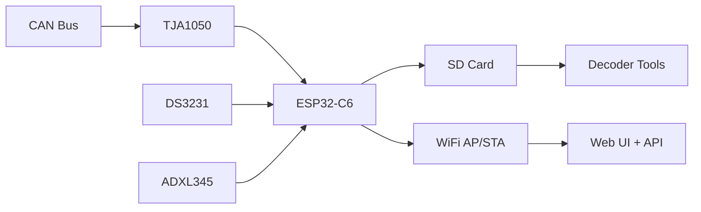
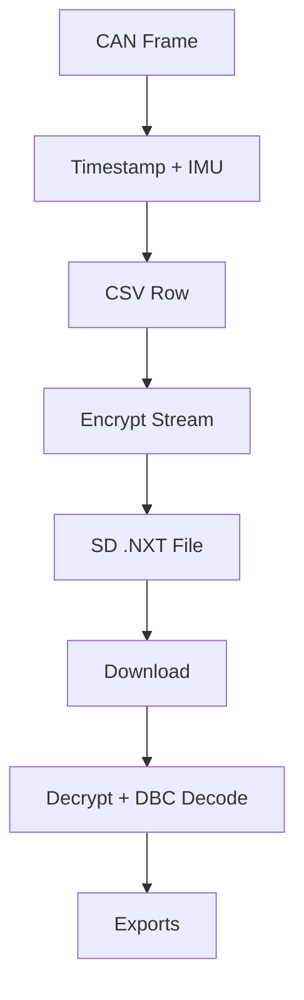

# Architecture Overview

## System Block Diagram

## Subsystems
- CAN interface: TWAI driver, high RX queue, no filtering
- Time: DS3231 RTC with optional NTP sync
- Storage: SD card with rollover and encrypted payload
- Web: file list, download, delete, live frames
- IMU: linear acceleration logged into CSV

## Data Flow (High Level)

