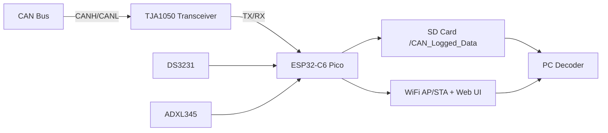
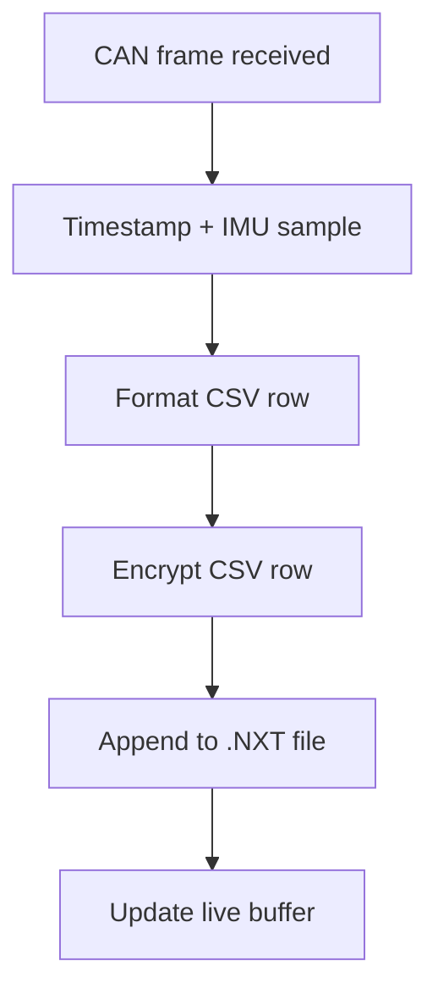

# CAN Data Logger for ESP32-C6 Pico
## Technical Documentation (2026-01-29)

## Executive Summary
The CAN Data Logger captures CAN frames, timestamps them with an RTC, adds optional IMU data, encrypts the log, and stores it on an SD card as `.NXT` files. A built-in web UI allows file management and live monitoring. Python decoders provide GUI and CLI workflows with DBC support and export formats.

## System Architecture

## Hardware Components
- ESP32-C6 Pico (main controller)
- TJA1050 CAN transceiver
- DS3231 RTC module
- SD card module (SPI)
- ADXL345 IMU (optional)
- Neopixel LED (optional)

### Pin Map (current firmware)
| Signal | GPIO |
|--------|------|
| CAN TX | 17 |
| CAN RX | 16 |
| SD CS | 15 |
| SD MOSI | 20 |
| SD MISO | 19 |
| SD SCK | 18 |
| RTC/IMU SDA | 22 |
| RTC/IMU SCL | 23 |
| Neopixel | 8 |

## Firmware Architecture
The firmware is a single Arduino sketch with these functional blocks:
- Initialization (Serial, LED, RTC, IMU, WiFi, SD, CAN)
- CAN receive loop (TWAI)
- Timestamping (RTC with fallback to compile time)
- Log file management (create, rollover, flush)
- Encryption (stream cipher per byte)
- Web server (status, file list, download, delete, live frames)

## Logging Pipeline

## NXTLOG File Format (Summary)
- 16-byte NXTLOG header (signature, version, header size, nonce)
- Encrypted CSV payload (header line + rows)
- See `File_Format_Specification.md` and `docs/NXTLOG_FILE_FORMAT.md`

## Web UI
The web UI runs on the ESP32 and provides:
- System status (RTC, SD, CAN, WiFi)
- File listing and downloads
- File delete (multi-select)
- Live CAN frames

REST endpoints are documented in `docs/WEB_SERVER_API.md`.

## Decoder Tools
- `CAN_Data_Decoder_New.py`: GUI, decrypts `.NXT`, applies DBC, exports multiple formats
- `dbc_decoder_gui.py`: simple GUI for `.NXT` or CSV + DBC
- `dbc_decode_csv.py`: CLI tool for `.NXT` or CSV + DBC
- `dbc_decoder_web.py`: Streamlit UI (CSV input)
- `OnlyCAN_Data_decoder.py`: legacy CAND/AES decoder (not for current logs)

## Time and Synchronization
- RTC is the primary time source when present.
- If STA is connected, NTP sync is attempted in the background.
- If RTC is missing, compile-time is used as a fallback.

## LED Behavior
| Color | Meaning |
|------|---------|
| BLUE | Boot/initialization |
| YELLOW | CAN driver initializing |
| CYAN | WiFi AP ready |
| GREEN | All systems ready (RTC + SD + WiFi + CAN + log file) |
| MAGENTA | Active logging (recent CAN frames) |
| ORANGE | Logging stopped after traffic (timeout) |
| RED | Missing/failed component |

## Performance and Limits
- Max file size: 10 MB (rollover to new file)
- CAN RX queue: 256
- Live buffer: 200 frames
- Flush interval: 20 frames

## References
- `README.md`
- `INSTALLATION_GUIDE.md`
- `CONFIGURATION_GUIDE.md`
- `File_Format_Specification.md`
- `docs/ARCHITECTURE_OVERVIEW.md`
- `docs/FIRMWARE_DEEP_DIVE.md`
- `docs/DECODER_DEEP_DIVE.md`
- `docs/WEB_SERVER_API.md`
