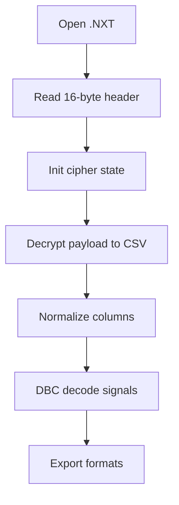

# Decoder Deep Dive

The repo includes multiple decoder options. Choose based on your workflow.

## 1) CAN_Data_Decoder_New.py (GUI)
- Decrypts `.NXT` (NXTLOG)
- Loads CSV into pandas
- Applies DBC decoding with cantools
- Exports CSV/XLSX/MAT/JSON/SQL/Parquet/HDF5/MDF/MF4

Notes:
- Output columns are aligned to a fixed schema (new.csv style).
- Signal names such as `Bus_current`, `Motor_speed`, etc. must exist in the DBC to populate those columns.
- Includes additional correction logic for some signals (e.g., Bus_current).

## 2) dbc_decoder_gui.py (Simple GUI)
- Decrypts `.NXT` or reads CSV
- Decodes all signals and writes averaged + raw CSV outputs
- Good for quick DBC-based analysis

## 3) dbc_decode_csv.py (CLI)
- Decrypts `.NXT` or reads CSV
- Outputs a decoded CSV table via CLI
- Easy for batch processing

## 4) dbc_decoder_web.py (Streamlit)
- Web UI for decoding CSV logs with DBC
- Suitable for interactive exploration

## 5) OnlyCAN_Data_decoder.py (Legacy)
- Only for old CAND/AES logs
- Not compatible with current NXTLOG format

## Decode Pipeline (NXTLOG)

