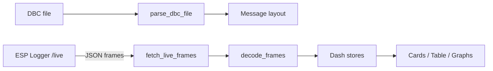
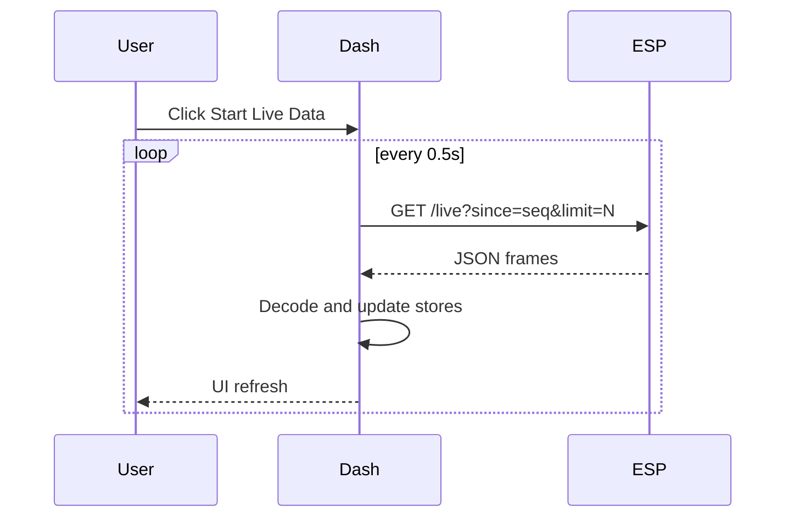
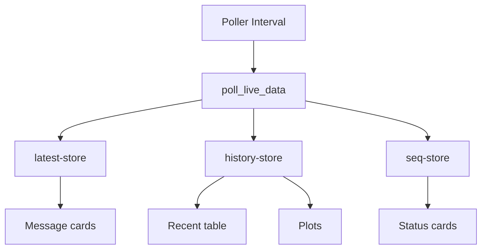

# Live Dashboard Architecture and Function Guide (Detailed)

This document explains how `Live_Dashboard.py` works end-to-end, why key parameters exist, and what a developer needs to know to explain, maintain, or extend the dashboard. It is intentionally detailed and written in simple words.

---

## Table of Contents

1. Purpose and Scope
2. Architecture Overview
3. Data Sources and Inputs
4. Output Views and UI Sections
5. /live JSON Contract
6. Internal Data Model
7. DBC Loading and Layout Building
8. Polling Strategy and Sequence Handling
9. Decoding and Signal Rows
10. Bus Current Sanity Correction
11. History Management and Memory Limits
12. Graph System and Downsampling
13. Dash State Stores
14. Callback Map (What Updates What)
15. Theme System
16. Prometheus Metrics
17. Configuration and Tuning
18. Performance and Stability Design Choices
19. Troubleshooting and Diagnostics
20. Extension Points
21. Known Limitations
22. Diagrams (Mermaid)
23. PDF Exports (Included)

---

## 1) Purpose and Scope

The live dashboard is a polling-based UI for CAN data. It connects to an ESP logger over Wi-Fi, fetches raw CAN frames, decodes them using a DBC file, and shows:
- Latest signal values grouped by message
- Recent decoded rows in a table
- Optional time series graphs

The core design goals are:
- Real-time readability
- Avoiding UI freezes
- Clear separation between raw data fetch, decode, and rendering

---

## 2) Architecture Overview

At a high level:
- The ESP logger exposes `/live` over HTTP.
- The dashboard polls `/live` with a `since` sequence number.
- Each received frame is decoded through `cantools` using the selected DBC.
- The UI is updated via Dash stores and callbacks.

The system is deliberately split into three layers:
1) Data acquisition (HTTP polling)
2) Data processing (DBC decode + cleanup)
3) Data presentation (cards, table, graphs)

---

## 3) Data Sources and Inputs

**Primary source**
- `/live` HTTP endpoint from the ESP logger.

**Secondary source**
- DBC file in `DBC_Dump/` folder.

**User controls**
- Base URL (IP of ESP)
- DBC selection
- Start Live Data button
- Theme toggle
- Graph signal selection

**Environment variables**
- Performance and behavior tuning (details in section 17).

---

## 4) Output Views and UI Sections

The UI is organized into:

1) Header
- Title and logo
- Theme toggle
- Session status pill

2) Connection Dock
- Base URL input
- DBC dropdown
- Start Live Data button
- Status text

3) Recent Signals Table
- Shows the latest 100 decoded rows

4) Message Matrix
- Card grid grouped by message
- Each card shows signal name, unit, latest value, and timestamp

5) Signal Lab (Graphs)
- Add/remove/reorder graph panels
- Each graph can plot one or more signals

---

## 5) /live JSON Contract

The dashboard expects the ESP to return:

```
{
  "status": "ok",
  "latest": <sequence number>,
  "frames": [
    {
      "seq": <sequence number>,
      "time": "YYYY-MM-DD HH:MM:SS",
      "unix": <unix seconds>,
      "micros": <microseconds>,
      "id": "hex string without 0x",
      "extended": true/false,
      "rtr": true/false,
      "dlc": <0..8>,
      "data": ["AA", "BB", "CC", ...]
    }
  ]
}
```

Notes:
- `latest` is used to request only new frames.
- `frames` can be empty when no CAN traffic is present.
- Optional fields like `boot` are handled gracefully if present.

---

## 6) Internal Data Model

The dashboard transforms raw frames into a normalized row structure:

```
{
  "Seq": <sequence>,
  "Time": "YYYY-MM-DD HH:MM:SS",
  "Unix": <unix seconds>,
  "CAN_ID": "0x411",
  "Message": "MCU_Status",
  "Signal": "Motor_speed",
  "Value": 1500.0,
  "Unit": "rpm"
}
```

This format is used everywhere:
- History table
- Message cards
- Graphs

---

## 7) DBC Loading and Layout Building

Key functions:
- `list_dbc_files()` reads all `.dbc` files from `DBC_Dump/`.
- `parse_dbc_file()` loads the DBC with `cantools` and builds a layout structure:
  - A list of messages
  - Each message has a list of signals and units

The layout is used to build the message card grid even before live data arrives.

---

## 8) Polling Strategy and Sequence Handling

Polling is driven by `dcc.Interval` (default 500 ms). Each poll:
1) Calls `/live` with `since=last_seq` and `limit=LIVE_FETCH_LIMIT`.
2) Filters out any frames with `seq <= last_seq`.
3) Updates `seq-store` to the max seen.

Why:
- Prevents duplicate frames.
- Keeps UI updates minimal.

---

## 9) Decoding and Signal Rows

`decode_frames()`:
- Converts hex strings to bytes.
- Uses `cantools` to decode each CAN message.
- Produces one row per signal.

This allows the dashboard to:
- Show each signal separately
- Maintain signal history across messages

---

## 10) Bus Current Sanity Correction

Some DBCs or loggers produce unrealistic `Bus_current` values. The dashboard includes a safety correction:
- If `Bus_current` magnitude is too large, alternate interpretations are tested.
- Candidate values are generated using endian swaps and offset removal.
- The value closest to the previous reading is chosen if within bounds.

This is controlled by:
- `BUS_CURRENT_TRIGGER`
- `BUS_CURRENT_MIN`
- `BUS_CURRENT_MAX`

---

## 11) History Management and Memory Limits

To prevent UI freezing and memory growth:
- `MAX_HISTORY_ROWS` limits stored history.
- The table only shows the latest 100 rows.
- When no new rows arrive, the callback returns `no_update` so Dash does not re-render.

---

## 12) Graph System and Downsampling

Graphs are optional and user-driven:
- User chooses signals for each graph.
- The dashboard sorts signal points by time.
- If too many points exist, only the most recent `GRAPH_MAX_POINTS` are shown.

This keeps Plotly rendering fast.

---

## 13) Dash State Stores

Dash stores are used to avoid expensive recomputation:
- `dbc-store`: DBC layout and ID
- `latest-store`: latest signal values (per signal)
- `history-store`: decoded rows (bounded)
- `seq-store`: last sequence number
- `poll-store`: connection health
- `boot-store`: optional boot ID
- `theme-store`: dark/light state
- `graph-list-store`: user-created graphs
- `live-enabled`: indicates polling status

---

## 14) Callback Map (What Updates What)

Key callbacks:
- `set_theme()` -> `theme-store`
- `update_theme_styles()` -> all theme styles
- `handle_dbc_selection()` -> DBC layout + clears stores
- `start_live_data()` -> enables poller
- `poll_live_data()` -> updates history, latest, seq, status text
- `update_cards()` -> message grid
- `update_history_table()` -> recent table rows
- `update_status_cards()` -> connection summary
- `modify_graph_list()` -> graph creation/removal
- `render_graph_blocks()` -> graph panel layout
- `update_graph()` -> plot rendering

---

## 15) Theme System

The theme toggle switches between dark/light colors:
- Uses CSS variables like `--panel-bg` and `--text-strong`.
- Each UI component references these variables.
- Changing theme updates styles without reloading the page.

---

## 16) Prometheus Metrics

If `prometheus_client` is installed:
- `/metrics` exposes gauges for:
  - signal values
  - poll status
  - last sequence

If not installed, a safe dummy response is returned.

---

## 17) Configuration and Tuning

Environment variables:
- `LIVE_FETCH_LIMIT` (default 50)
- `LIVE_MAX_HISTORY_ROWS` (default 2000)
- `GRAPH_MAX_POINTS` (default 600)
- `LIVE_POLL_TIMEOUT` (default 3.0)
- `BUS_CURRENT_TRIGGER` (default 80)
- `BUS_CURRENT_MIN` (default -100)
- `BUS_CURRENT_MAX` (default 120)
- `ENABLE_PROM_METRICS` (default true)

---

## 18) Performance and Stability Design Choices

Why these choices exist:
- Keep-alive session reduces HTTP overhead.
- `no_update` prevents heavy re-rendering when no new data arrives.
- Bounded history avoids memory bloat.
- Downsampling avoids slow graph rendering.

These are critical for real-time stability.

---

## 19) Troubleshooting and Diagnostics

Common issues:

**Waiting for CAN frames**
- The ESP is not sending data or CAN is idle.
- Check `/live` directly in a browser.

**Live frames received but no decoded signals**
- DBC does not match actual CAN IDs.
- Confirm DBC selection.

**Dashboard freezes**
- Reduce `LIVE_FETCH_LIMIT` and `GRAPH_MAX_POINTS`.
- Ensure ESP is not re-sending old frames.

---

## 20) Extension Points

Typical extension tasks:
- Add new signals by updating DBC only.
- Add new panels by storing state in `dcc.Store` and adding callbacks.
- Add filtering by message/signal in `decode_frames()`.
- Add new endpoints by extending `/live` contract.

---

## 21) Known Limitations

- Polling is not true streaming; very high bus rates may require lower poll interval or server-side batching.
- If DBC endianness differs from logger bit extraction, decoded values may be wrong.
- Dash updates can slow with very large graph counts.

---

## 22) Diagrams (Mermaid)

### 22.1 Architecture Flow



### 22.2 Polling Sequence



### 22.3 State Update Flow



---

## 23) PDF Exports (Included)

The following PDF files are included for easier sharing:
- `LIVE_DASHBOARD_ARCHITECTURE.pdf`
- `LIVE_DASHBOARD_SEQUENCE.pdf`

These PDFs summarize the same architecture and flow with visuals.

---
